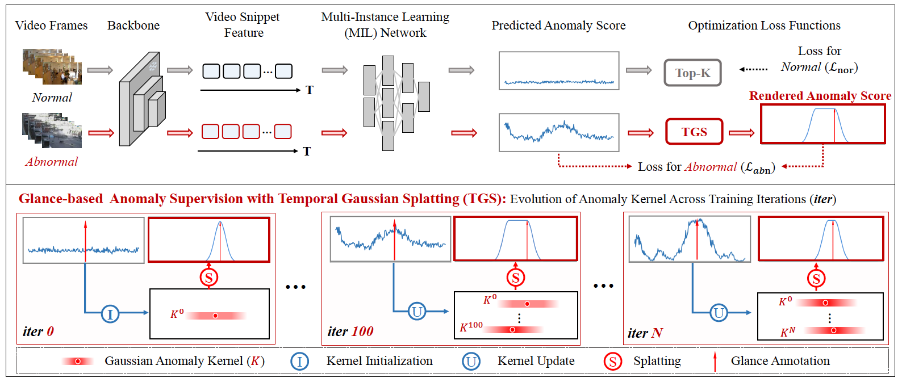
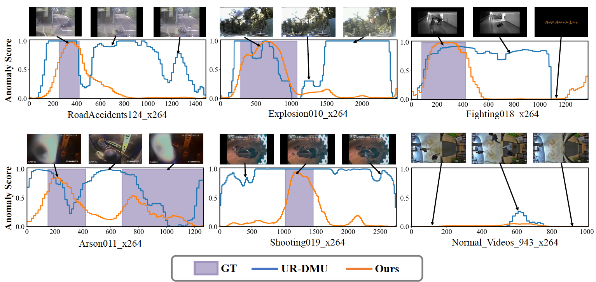

# GlanceVAD: Exploring Glance Supervision for Label-efficient Video Anomaly Detection

<p align="center">

  </p>


> **Abstract:**
> In recent years, video anomaly detection has been extensively investigated in both unsupervised and weakly supervised settings to alleviate costly temporal labeling. Despite significant progress, these methods still suffer from unsatisfactory results such as numerous false alarms, primarily due to the absence of precise temporal anomaly annotation. In this paper, we present a novel labeling paradigm, termed "glance annotation", to achieve a better balance between anomaly detection accuracy and annotation cost. Specifically, glance annotation is a random frame within each abnormal event, which can be easily accessed and is cost-effective. To assess its effectiveness, we manually annotate the glance annotations for two standard video anomaly detection datasets: UCF-Crime and XD-Violence. Additionally, we propose a customized **GlanceVAD** method, that leverages gaussian kernels as the basic unit to compose the temporal anomaly distribution, enabling the learning of diverse and robust anomaly representations from the glance annotations. Through comprehensive analysis and experiments, we verify that the proposed labeling paradigm can achieve an excellent trade-off between annotation cost and model performance. Extensive experimental results also demonstrate the effectiveness of our GlanceVAD approach, which significantly outperforms existing advanced unsupervised and weakly supervised methods. Code and annotations will be publicly available.

> **Motivation:**
> Our key insight is to leverage anomaly video data, which is harder to collect compared with normal videos, through extremely cost-efficient glance annotation (one frame click during abnormal events). The reduced bias toward the anomaly context results in significant performance improvement, which provides a new practical labeling paradigm for Video Anomaly Detection.
<p align="center">

  </p>

## 🆕:Updates
- (2024-12-02)  Code and annotations are available now.
- (2024-03-08) Comming soon.

## 📖:Preparation
### Environment
- torch==1.13.1+cu117 
- tensorboard == 2.8.0 
- tqdm
- termcolor

### Data Preparation
- [UCF-Crime 10-crop I3D features](https://stuxidianeducn-my.sharepoint.com/personal/pengwu_stu_xidian_edu_cn/_layouts/15/onedrive.aspx?id=%2Fpersonal%2Fpengwu%5Fstu%5Fxidian%5Fedu%5Fcn%2FDocuments%2FUCF%2DCrime%2FI3D&ga=1)
- [XD-Violence 5-crop I3D features](https://roc-ng.github.io/XD-Violence/)

Please ensure the data structure is as below.
~~~~
├── data
   └── ucf-crime
       ├── ucf-crime.training.csv
       ├── ucf-crime.testing.csv
       ├── ucf-crime_ground_truth.json
       ├── ucf_glance_annotations.csv  
       └── i3d
           ├── train
                ├── Abuse001_x264__1.npy
                ├── Abuse001_x264__2.npy
                └── ...
           └── test
                ├── Abuse028_x264__1.npy
                ├── Abuse028_x264__2.npy
                └── ...
~~~~


## 🚗:Training and Testing
- UCF-Crime
```bash
python main.py --hyp ucf_i3d --mode train
python main.py --hyp ucf_i3d --mode test
```
- XD-Violence
```bash
python main.py --hyp xd_i3d --mode train
python main.py --hyp xd_i3d --mode test
```
- Despite of viewing log files, you can also use TensorBoard to monitor the training process:
```bash
tensorboard --logdir=./ckpt
```

## 📝:Results
We use Area Under the Curve (AUC) of the frame-level Receiver Operating Characteristic (ROC) as the evaluation metric for UCF-Crime, and AUC of the frame-level precision-recall curve (AP) is utilized for XD-Violence as the standard evaluation metric.
we also evaluate the AUC/AP of abnormal videos (termed by AUC_A/AP_A)

|Method | Dataset  | Feature| AUC | AUC_A |
| ----- | -----    | ----- |----- | ----- |
|UR-DMU(baseline) |UCF-Crime | I3D   | 86.97 | 70.81 |
|**GlanceVAD**(Ours)|UCF-Crime | I3D   | **91.76** | **82.18** |

|Method | Dataset  | Feature|  AP | AP_A |
| ----- | -----    | ----- | ----- |----- |
|UR-DMU(baseline)| XD-Violence | I3D | 81.66 | 83.51 |
|**GlanceVAD**(Ours) | XD-Violence | I3D | **89.18** | **89.97** |

## 📊:Qualitative Results
<p align="center">

  </p>

##  🛰️:References
We apreciate the repos below for the codebase.

- [UR-DMU](https://github.com/henrryzh1/UR-DMU)
- [S3R](https://github.com/louisYen/S3R)
- [RTFM](https://github.com/tianyu0207/RTFM)
